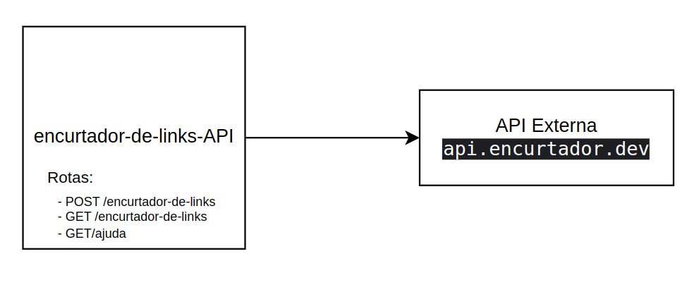

# Aplicação Spring: Projeto Encurtador de Links

Este projeto é uma aplicação Spring Boot que oferece uma API para encurtar URLs e para obter ajuda relacionada ao uso da API.

## Visão Geral ##

## Requisitos

Para executar este projeto, você precisará ter instalado:

- Java JDK 17 ou superior
- Maven

## Configuração do Projeto

Clone o repositório para sua máquina local usando:

```bash
git clone https://github.com/castroderaul23/projeto-encurtador-de-links.git
cd projeto-encurtador-de-links
```

## Como Executar
Após o clone do projeto, se preferir, pode executar o projeto diretamente pela IDE realizando a importação do projeto ou pode executar o projeto via linha de comando conforme instruções abaixo:

Dentro do diretório do projeto, execute o seguinte comando para construir o projeto com Maven:

```bash
mvn clean install
```

Após a construção do projeto, você pode executar a aplicação utilizando:
```bash
java -jar target/projeto-encurtador-de-links-0.0.1-SNAPSHOT.jar
```
Alternativamente, você pode executar o projeto diretamente via Maven usando:
```bash
mvn spring-boot:run
```

## Detalhamento da API
### Encurtar uma URL ###
Para encurtar uma URL, 
faça uma requisição POST para http://localhost:8080/encurtador-de-links com o body contendo a URL original.<br>
Exemplo de requisição:
```bash
curl -X POST http://localhost:8080/encurtador-de-links -H 'Content-Type: application/json' -d '{"url": "http://example.com"}'
```
## Listar todas as URLs encurtadas ##
Para obter uma lista de todas as URLs encurtadas, faça uma requisição GET para http://localhost:8080/encurtador-de-links.

Exemplo de requisição:
```bash
curl http://localhost:8080/encurtador-de-links
```

## Obter ajuda ##
Para obter informações de ajuda, faça uma requisição GET para  http://localhost:8080/ajuda.

Exemplo de requisição:
```bash
curl http://localhost:8080/ajuda
```